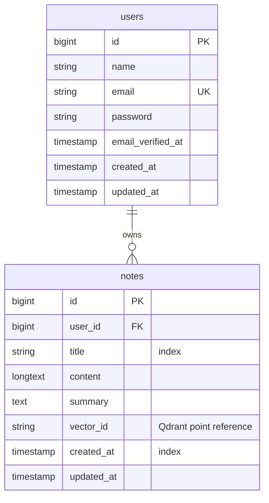

# AI-Powered Notes Management System (Laravel 11 & React.js)

A production-ready **AI Notes Management System** featuring user authentication (Sanctum), AI note summarization (Gemini), and AI vector-based semantic search (Qdrant).

This application was developed as a technical assessment submission, demonstrating Clean Architecture, secure APIs, modern SaaS design, and advanced vector search capabilities.

---

## 🚀 Key Features

1.  **Sanctum Authentication:** Secure token-based user registration, login, and session termination. Users can only access and query their own notes.
2.  **Notes CRUD REST APIs:** Input validation, proper HTTP response codes, transaction handling, and paginated lists.
3.  **✨ AI Semantic Search:** Integrates Qdrant vector database. Content is embedded into a 768-dimension vector and scored via Cosine Distance against queries using semantic similarities.
4.  **AI Note Summaries:** One-click generation of bulleted note summaries utilizing Google's Gemini LLM.
5.  **Offline Fallback Mode:** If Qdrant or Gemini keys are missing, the system automatically redirects vector indexes to a local flat-file simulator and utilizes text sentence parsers for summarizations, ensuring the app is 100% functional out-of-the-box.
6.  **SaaS Dashboard UI:** A beautiful dark-themed glassmorphism interface styled with Tailwind CSS, showing lists pagination, toast logs, skeletons loading cards, and detail modal panes.

---

## 🏛️ Project Architecture

We follow the principles of **Clean Architecture** and **Service Layer Patterns**:

### Laravel Backend Structure
```
backend/
 ├── app/
 │    ├── Http/
 │    │    ├── Controllers/
 │    │    │    └── Api/
 │    │    │         ├── AuthController.php  <-- Sanctum registration/login
 │    │    │         └── NoteController.php  <-- Note CRUD & search
 │    │    └── Middleware/
 │    │         └── Cors.php              <-- Cross-Origin header proxy
 │    │
 │    ├── Models/
 │    │    ├── User.php
 │    │    └── Note.php
 │    │
 │    ├── Services/
 │    │    ├── GeminiService.php         <-- Calls Gemini API
 │    │    ├── EmbeddingService.php      <-- Wraps vectorizer
 │    │    └── QdrantService.php         <-- Point queries to Qdrant/Local Mock
 ├── database/
 │    └── migrations/                    <-- MySQL database migrations
 └── tests/
      └── Feature/                       <-- NoteApiTest validations
```

### React Frontend Structure
```
frontend/
 ├── src/
 │    ├── services/
 │    │    └── api.ts                    <-- Axios instance with Auth Bearer injectors
 │    ├── App.tsx                        <-- Router pages and modals dashboard
 │    └── index.css                      <-- Global Tailwind directives & glass variables
```

---

## 🗄️ Database Design (MySQL Schema)

The `notes` table is structured with proper foreign keys and search indexes:



- **Indexes:**
  - `title` index: speeds up standard prefix and keyword searches.
  - `created_at` index: optimizes chronological pagination lists sorting.

---

## 🔑 Environment Configuration

Add the following environment variables to your `backend/.env` file:

```env
# Database Credentials
DB_CONNECTION=mysql
DB_HOST=127.0.0.1
DB_PORT=3306
DB_DATABASE=nvecta_notes
DB_USERNAME=root
DB_PASSWORD=

# Gemini API Key (Generate one at Google AI Studio)
GEMINI_API_KEY=your_gemini_api_key_here

# Qdrant Vector DB Settings
# Left blank, the application automatically runs in Local Fallback Mode
QDRANT_URL=http://localhost:6333
QDRANT_API_KEY=your_qdrant_cloud_api_key_here
```

---

## 🛠️ Installation & Setup (Beginner Friendly)

### 1. Backend Server Setup
1.  Navigate to the backend directory:
    ```bash
    cd backend
    ```
2.  Install composer dependencies:
    ```bash
    composer install
    ```
3.  Create your local `.env` configuration file:
    *Windows Command Prompt:* `copy .env.example .env`  
    *Mac/Linux/Powershell:* `cp .env.example .env`
4.  Generate application encryption key:
    ```bash
    php artisan key:generate
    ```
5.  Create a MySQL database named `nvecta_notes` using phpMyAdmin, XAMPP, or command-line:
    ```sql
    CREATE DATABASE nvecta_notes;
    ```
6.  Execute database migrations:
    ```bash
    php artisan migrate
    ```
7.  Run the API development server:
    ```bash
    php artisan serve --port=8000
    ```

### 2. Frontend React Setup
1.  Open a new terminal tab and navigate to the frontend directory:
    ```bash
    cd frontend
    ```
2.  Install node dependencies:
    ```bash
    npm install
    ```
3.  Launch Vite development server:
    ```bash
    npm run dev
    ```
4.  Visit `http://localhost:5173/` in your browser.

---

## 🐳 Running containerized with Docker Compose

To spin up Laravel, Nginx routing, MySQL, Redis cache, and Qdrant containers automatically:

1.  Make sure Docker Desktop is active.
2.  From the workspace root directory, run:
    ```bash
    docker-compose up --build -d
    ```
3.  Run migrations inside the backend container:
    ```bash
    docker-compose exec backend php artisan migrate
    ```
4.  The frontend dashboard is accessible on port 3000: `http://localhost:3000/`.

---

## 🧪 Testing

We have built automated feature tests in `backend/tests/Feature/NoteApiTest.php` verifying user registers, logins, logouts, note CRUD rules under Sanctum, resource ownership protections, and Qdrant search results.

Run the test suite using:
```bash
cd backend
php artisan test
```

---

## 🚀 Deployment Instructions

### Frontend (Vercel)
1. Add a `vercel.json` file to configure routes to point to `/index.html` (single-page router).
2. Connect your repository to Vercel, set root directory to `frontend/`, and click Deploy.

### Backend (Render / Railway using Docker)
1. Set up a PostgreSQL or MySQL database on Railway/Render.
2. Link your repository. Set root directory to `backend/` and environment variables.
3. Railway/Render will automatically read the `backend/Dockerfile` to compile and expose port 80/9000.

### Vector DB (Qdrant Cloud)
1. Create a free cluster on [qdrant.tech](https://qdrant.tech).
2. Retrieve your Cluster URL and API key and append them to the backend `.env`.

---

## 💡 AI Development Notes & Prompts

### AI Tools Utilized
- **Gemini 3.5 Flash** for design styling systems and mathematical cosine algorithms.
- **Vite & Artisan** CLI generators for boilerplate code.

### Sample Prompts
- *"Create a laravel Sanctum controller structure grouping notes under authenticated users."*
- *"Write a PHP client integration for Qdrant Cloud API to search similarity points using REST calls."*
- *"How to write a local fallback vector builder using keyword counting in PHP."*
